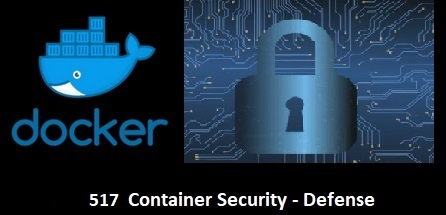

In many instances Docker containers are running with permissions set too wide/open. Users sometimes think that because they are running things within a container or throwing the container quickly away they are safe from attackers. These incorrect assumptions lead to fairly easy exploitation through attacks like Priv Escalation, DoS and resource exhaustion for example often seen with crypocurrency (e.g Bitcoin) mining attacks.

To constrain and limit use of host resources, users can customize the Docker runtime by use of Cgroups and Namespaces Linux kernel features

In this scenario we will see how we can protect/hardening the Docker Runtime by using these features to limit host resources. Each step will help you understand how to protect your containers better against potential malicious behaviour from adversaries.

You will learn how:

- How to set memory limits on containers
- How to limit/slice CPU usage
- How to isolate and share network
- How to map user/group IDs in use the PID Namespace
- How to isolate and share Namespaces

This help by protecting against:

- Resource starvation
- Denial of Service (DoS) attacks
- Privilege escalation
- Cryptocurrency mining attacks

> [Docker](https://www.docker.com) is multi-paradigm platform/tool designed to make it easier to create, deploy and run applications by running containers. Containers allow a developer to package up an application with all of the parts it needs, such as libraries and other dependencies, and deploy it as one package . -[opensource.com > resources > what-docker](https://opensource.com/resources/what-docker))

